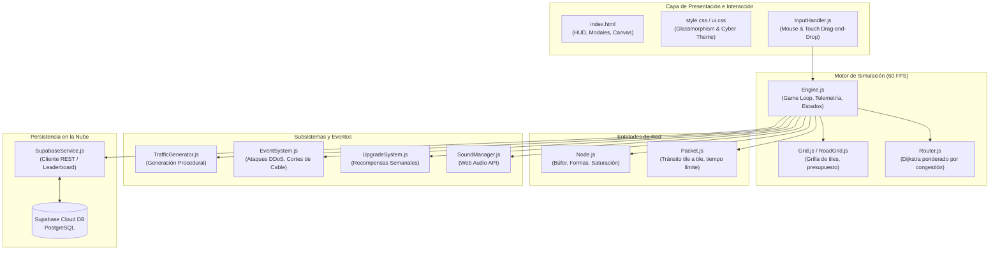

# 🌐 NetMetro: Packet Routing Simulator

> **Actividad de Proyecto: Reto de Nuevas Tecnologías**  
> **Asignatura:** Nuevas Tecnologías | ISND (Ingeniería en Sistemas y Negocios Digitales)  
> **Integrantes:**  
> - 👨‍💻 **Rodolfo Ramírez Castillo**  
> - 👨‍💻 **Jorge del Angel Mascareñas**  

---

## 📌 1. Descripción del Proyecto

**NetMetro** es un videojuego de estrategia y gestión de tráfico de redes en tiempo real inspirado en la mecánica visual y adictiva de *Mini Motorways*. 

En el juego, el usuario asume el rol de un **Ingeniero de Infraestructura de Telecomunicaciones**. A medida que avanza el tiempo virtual (días y semanas), emergen —con moderación— nuevas estaciones de red procedurales (servidores de aplicaciones, terminales cliente, bases de datos y nodos CDN). Cada nodo genera tráfico hacia **otro nodo de su misma forma** (cuadrado con cuadrado, círculo con círculo...). El jugador debe tender, arrastrando el mouse sobre una grilla, una red de cableado compartida que interconecte esos pares para transportar paquetes de datos a tiempo, antes de que se agote su tiempo límite de entrega o de que la memoria de búfer de cualquier nodo se desborde (**Buffer Overflow**), provocando la caída catastrófica de la red.

---

## 🚀 2. Enlace Público y Repositorio

- **URL de Producción (GitHub Pages):** `https://<tu-usuario>.github.io/net-metro/`
- **Repositorio de Código Fuente:** `https://github.com/<tu-usuario>/net-metro`

---

## 🎮 3. Mecánicas de Juego y Controles

### Controles
| Acción | Control |
| :--- | :--- |
| **Tender Cable** | Mantén presionado el clic izquierdo y **arrastra** sobre la grilla del mapa. |
| **Retirar Tramo de Cable** | Clic derecho sobre un tramo de cable (reembolsa 1 pieza). |
| **Aplicar Acelerador de Protocolo (⚡)** | Clic en el icono ⚡ de la bandeja inferior y luego clic en un tramo de cable existente. |
| **Instalar Balanceador (⚖️)** | Clic en el icono ⚖️ de la bandeja inferior y luego clic en el nodo deseado. |
| **Instalar Switch de Red (🔀)** | Clic en el icono 🔀 de la bandeja inferior y luego clic en el nodo donde instalarlo. |
| **Pausar / Reanudar** | Tecla `Espacio` o botón `⏸` / `▶` en la barra superior. |
| **Acelerar Tiempo** | Tecla `1` (Normal 1x) o Tecla `2` (Rápido 2.2x). |

### Gestión del Presupuesto de Cable
- **Piezas de Cable:** Cada tramo tendido en la grilla consume 1 pieza del presupuesto (equivalente a un costo por píxel, ya que cada tramo mide un tamaño fijo). No hay un límite máximo de piezas: cada Domingo a medianoche se otorga un lote adicional automáticamente.
- **Hardware Especial:** Inicias con **0** Aceleradores de Protocolo, Balanceadores de Carga y Switches de Red. Solo puedes colocarlos cuando los consigas en las recompensas de fin de semana — el Switch, igual que el Balanceador, lo instalas tú mismo en el nodo que elijas (nunca se coloca automáticamente).
- **Retirar un tramo acelerado** devuelve tanto la pieza de cable como el Acelerador de Protocolo a tu bandeja, para que puedas reubicarlo. Un paquete que cruza un tramo acelerado conserva esa velocidad extra por el resto de su viaje.

### Tráfico por Pares de Forma
Cada figura representa su propio par emisor/receptor: un nodo cuadrado envía paquetes hacia **otro** nodo cuadrado, un círculo hacia otro círculo, y así con cada forma. Los nodos nuevos aparecen con moderación (no todos a la vez) para que el presupuesto de cable pueda mantener el ritmo de la red.

### Congestión y Enrutamiento
Cada paquete despachado añade "carga" a los tramos de cable que usa, la cual se disipa con el tiempo. El `Router.js` usa un Dijkstra ponderado por esa carga: si existe más de un camino posible entre dos nodos, prefiere el menos transitado en vez de amontonar siempre todo el tráfico sobre la ruta más corta. Los tramos muy cargados se tiñen de **violeta** en el mapa como pista visual.

### Tipos de Nodos y Formas
- 🔵 **Terminal Cliente (Círculo):** Genera tráfico continuo de usuarios.
- 🟦 **Servidor Web / Aplicación (Cuadrado):** Procesa peticiones de software.
- 🔺 **Base de Datos Central (Triángulo):** Almacena datos relacionales críticos.
- ⬡ **Almacén CDN Edge (Hexágono):** Alivia cuellos de botella en la red perimetral.
- ⭐ **Core Router IXP (Estrella):** Centro de intercambio de alto tráfico.

### Condición de Victoria y Derrota
- **Derrota por saturación:** Si el búfer de cualquier nodo se satura, comenzará a llenarse un **círculo rojo semitransparente en sentido horario**. Si permanece saturado y el círculo se completa (360° en 6 segundos), la red colapsará por **Buffer Overflow**.
- **Derrota por tiempo excedido:** Cada paquete tiene un **tiempo límite de entrega**. Si lo supera (esperando en un nodo o viajando por el cable), se pierde y suma al contador de **Paquetes Perdidos**; superar el máximo tolerado también termina la partida.
- **Victoria:** Superar la cuota de semanas estipuladas en cada misión (Semana 3 en Campus LAN, Semana 5 en Metropolitan ISP, Semana 7 en Global Cloud Backbone).

---

## 💡 4. Nuevas Tecnologías Integradas

El proyecto integra de manera nativa dos tecnologías complementarias a la programación base:

1. **Supabase Cloud (BaaS / PostgreSQL):**
   - Base de datos relacional en la nube para registrar y consultar las puntuaciones más altas del **Ranking Global de Ingenieros de Red**.
   - El Leaderboard es exclusivamente en línea: si no hay conexión a Supabase, no se pueden guardar ni consultar puntuaciones (no existe respaldo local ni datos de relleno).
2. **Generación Procedural y Web Audio API:**
   - **Algoritmo de dispersión estocástica:** Ubicación inteligente de nuevos nodos en el mapa con prevención de colisiones espaciales.
   - **Síntesis sonora dinámica:** Generación en tiempo real de tonos armónicos pentatónicos y alertas acústicas de congestión mediante la `Web Audio API` sin necesidad de archivos MP3 externos.

---

## 🏗️ 5. Arquitectura del Software

El proyecto fue diseñado bajo una arquitectura modular desacoplada utilizando **JavaScript Moderno (ES Modules)**, **HTML5 Canvas 2D** y **CSS3 Glassmorphism**.



---

## 🗄️ 6. Configuración de Supabase (Paso a Paso)

Para conectar tu propio proyecto de Supabase:

1. Entra a [https://supabase.com](https://supabase.com) y crea un nuevo proyecto gratuito.
2. Abre la pestaña **SQL Editor** en el panel de Supabase y ejecuta la siguiente consulta:

```sql
-- Crear tabla de ranking global
create table if not exists leaderboard (
  id bigint generated by default as identity primary key,
  player_name text not null,
  score_packets int not null,
  weeks_survived int not null,
  level_name text not null,
  created_at timestamp with time zone default timezone('utc'::text, now()) not null
);

-- Habilitar lectura y escritura pública para jugadores
alter table leaderboard enable row level security;

create policy "Permitir lectura publica" 
on leaderboard for select using (true);

create policy "Permitir insercion publica" 
on leaderboard for insert with check (true);
```

3. Ve a **Project Settings -> API** en Supabase y copia:
   - **Project URL**
   - **anon / public key**
4. En el videojuego, abre el menú **⚡ Supabase**, pega ambas claves y pulsa **Probar Conexión** y **Guardar Credenciales**. ¡Listo! Todas las partidas se sincronizarán directamente en la nube.

---

## 📦 7. Cómo Ejecutar Localmente y Desplegar en GitHub Pages

### Ejecución Local
No requiere compiladores ni herramientas complejas (Node.js/npm es opcional). Puedes ejecutarlo con cualquier servidor estático:

- **Opción A (Python):**
  ```bash
  python -m http.server 8080
  ```
  Abre `http://localhost:8080` en tu navegador.

- **Opción B (VS Code Live Server):**
  Haz clic derecho en `index.html` y selecciona *"Open with Live Server"*.

Para conectar el Leaderboard a tu propio Supabase en local: copia `src/config/supabaseConfig.example.js` como `src/config/supabaseConfig.js` (ese nombre ya está en `.gitignore`, nunca se sube) y completa `url`/`anonKey` con los datos de tu proyecto — usa siempre la clave **anon / publishable** (`sb_publishable_...`), nunca la **secret** (`sb_secret_...`).

### Despliegue en GitHub Pages (vía GitHub Actions, con las claves como Secrets)
Las claves de Supabase **no** se suben al repositorio: viven como *Secrets* de GitHub y el workflow `.github/workflows/deploy.yml` las inyecta automáticamente al publicar.

1. Crea un repositorio en GitHub y sube el proyecto a la rama `main` (el `.gitignore` ya excluye tu `supabaseConfig.js` local):
   ```bash
   git init
   git add .
   git commit -m "Versión final NetMetro ISND"
   git branch -M main
   git remote add origin https://github.com/<tu-usuario>/net-metro.git
   git push -u origin main
   ```
2. En el repositorio, ve a **Settings -> Secrets and variables -> Actions -> New repository secret** y crea:
   - `SUPABASE_URL`: la Project URL de tu proyecto de Supabase.
   - `SUPABASE_ANON_KEY`: tu clave **anon / publishable** (nunca la secret).
3. Ve a **Settings -> Pages** y en **Build and deployment -> Source** selecciona **GitHub Actions** (en vez de "Deploy from a branch").
4. Cada `git push` a `main` dispara el workflow, que genera `src/config/supabaseConfig.js` con esos Secrets solo para el artefacto publicado (nunca queda guardado en el repositorio) y despliega el sitio. Puedes seguirlo en la pestaña **Actions**.
5. Tu juego quedará publicado en la URL que GitHub Pages indique (visible también en **Settings -> Pages** una vez termine el primer despliegue).

### Despliegue en Vercel (alternativa, con las claves como Environment Variables)
Vercel no usa Secrets de GitHub sino sus propias **Environment Variables** por proyecto. El repositorio ya trae todo lo necesario: `package.json` (con el script `build`), `vercel.json` (le dice a Vercel que no hay framework y cuál es el comando de build) y `scripts/generate-supabase-config.mjs` (genera `src/config/supabaseConfig.js` en cada build, igual que en GitHub Actions).

1. Sube el proyecto a un repositorio de GitHub (ver pasos 1 del despliegue anterior; no hace falta repetirlo si ya lo hiciste).
2. En [vercel.com](https://vercel.com), **Add New... -> Project** e importa ese repositorio.
3. En la pantalla de configuración del proyecto (o después en **Settings -> Environment Variables**), agrega:
   - `SUPABASE_URL`: la Project URL de tu proyecto de Supabase.
   - `SUPABASE_ANON_KEY`: tu clave **anon / publishable** (nunca la secret) — márcala para los 3 entornos (Production, Preview, Development) si quieres que funcione también en los previews de cada PR.
4. Framework Preset: Vercel debería detectar **"Other"** automáticamente gracias a `vercel.json`; si te pregunta, dejar Build Command en `npm run build` y Output Directory en `.` (raíz).
5. Pulsa **Deploy**. Cada push posterior a la rama conectada (normalmente `main`) genera un nuevo deploy automático, y cada Pull Request obtiene su propia URL de preview.
